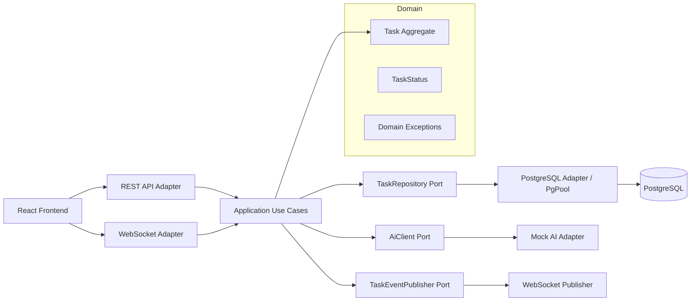
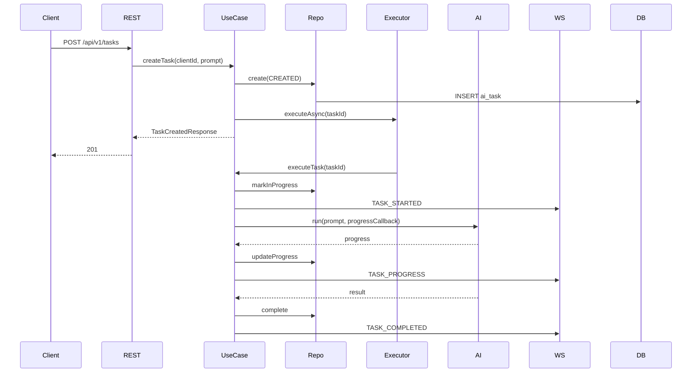
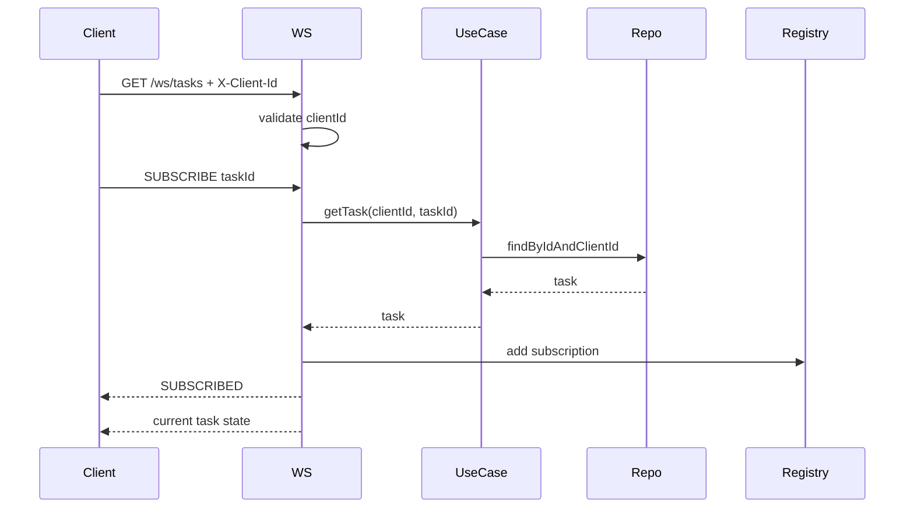
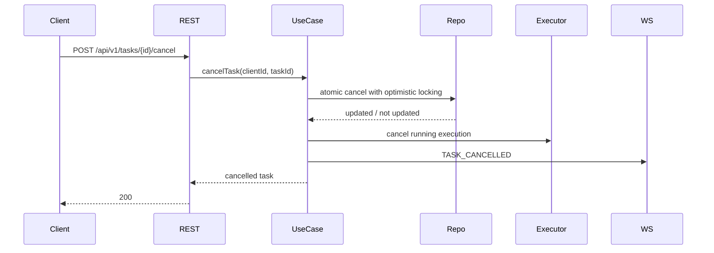

# План реализации проекта AI Agent

План составлен строго по `task.md`. На момент подготовки плана обнаружено противоречие: в `task.md` сказано, что папка проекта полностью пустая, но фактически в корне уже есть Gradle-файлы, `src`, `.gradle`, `.idea`, `prompt.md`, `task.md`. Для реализации это означает: проект нужно вести как создаваемый с нуля, но перед фактическими изменениями отдельно решить, очищать ли текущую структуру или аккуратно приводить её к требуемому виду.

`prompt.md` сейчас пустой. Требование “каждый оригинальный промт нужно добавить последовательно в `prompt.md`” должно быть выполнено на первом этапе реализации.

## 1. Краткое описание решения

Проект — монорепозиторий:

- backend: Java 21 + Vert.x;
- frontend: React + TypeScript + Vite в каталоге `frontend`;
- БД: PostgreSQL;
- миграции: Liquibase XML;
- API: REST + WebSocket;
- AI-интеграция: mock-адаптер с прогрессом, ошибкой, таймаутом и отменой;
- архитектура: гексагональная;
- тесты: unit, repository, integration PostgreSQL через Testcontainers, REST, WebSocket, frontend.

Backend принимает задачу, сохраняет её в PostgreSQL, запускает асинхронное выполнение через application use case, обновляет статус/прогресс через репозиторий и отправляет события подписчикам WebSocket.

## 2. Обоснование выбранного стека

Стек берётся из задания без замены:

- Java 21 — актуальная LTS-версия.
- Vert.x Core/Web/Web Client — неблокирующий backend без Spring.
- Vert.x Pg Client / SQL Client — асинхронная работа с PostgreSQL через `PgPool`.
- Liquibase + JDBC PostgreSQL driver — управление схемой до старта приложения.
- Jackson — JSON DTO и WebSocket-сообщения.
- SLF4J + Logback — логирование с correlation ID.
- JUnit 5, Vert.x JUnit 5, Mockito, AssertJ — unit и async-тестирование.
- Testcontainers PostgreSQL — интеграционные тесты без локальной тестовой БД.
- React + TypeScript + Vite — frontend внутри того же репозитория.
- Docker Compose — локальный запуск backend + frontend + PostgreSQL.

Стабильные версии зависимостей:

```kotlin
val vertxVersion = "4.5.10"
val jacksonVersion = "2.17.2"
val liquibaseVersion = "4.29.2"
val postgresqlVersion = "42.7.4"
val slf4jVersion = "2.0.16"
val logbackVersion = "1.5.8"
val junitVersion = "5.11.0"
val mockitoVersion = "5.12.0"
val assertjVersion = "3.26.3"
val testcontainersVersion = "1.20.1"
```

Vert.x подключать через BOM:

```kotlin
implementation(platform("io.vertx:vertx-stack-depchain:$vertxVersion"))
```

## 3. Архитектура приложения и применение гексагональной архитектуры

Направление зависимостей:

```text
domain <- application <- adapters
```

`domain` не зависит от `application`, `infrastructure`, `web`, `frontend`.

Пакеты backend:

```text
ru.spb.aiagent
  domain
    model
    exception
    repository
  application
    usecase
    port
    service
  infrastructure
    config
    db
    liquibase
    repository
    ai
    logging
  web
    rest
    websocket
    dto
    exception
    mapper
```

Роли:

- `domain` — сущность задачи, статусы, бизнес-инварианты, доменные исключения.
- `application/usecase` — сценарии: создать задачу, получить задачу, список, отменить, выполнить задачу.
- `application/port` — выходные порты: AI-клиент, publisher событий, clock, task executor.
- `TaskRepository` лучше разместить в `application/port`, потому что репозиторий нужен use case-слою.
- `infrastructure/repository` — Vert.x PostgreSQL adapter.
- `infrastructure/ai` — mock AI adapter.
- `web/rest` — HTTP handlers.
- `web/websocket` — WebSocket endpoint, subscriptions, dispatch.
- `web/exception` — централизованный error mapper.

## 4. Работа `vertx-pg-client` с PostgreSQL

Основной компонент доступа к БД:

```java
PgPool pgPool
```

Принципы:

- `PgPool` создаётся один раз при старте приложения после успешного Liquibase.
- HTTP/WebSocket handlers не работают с `SqlConnection` напрямую.
- Все SQL-операции инкапсулируются в `PostgresTaskRepository`.
- Репозиторий возвращает `Future<T>`.
- Запросы выполняются через `preparedQuery`.
- Параметры передаются через `Tuple`.
- `Row` преобразуется в доменные объекты отдельным mapper-классом.
- SQL-ошибки логируются внутри infrastructure и преобразуются в application/domain exceptions без утечки SQL наружу.
- Пул закрывается при shutdown.
- Размер пула берётся из `DATABASE_POOL_SIZE`.
- `withConnection` используется, когда нужно несколько операций на одном соединении без транзакции.
- `withTransaction` используется для атомарных операций: создание задачи + событие, отмена + событие, сложные изменения состояния.
- AI-вызовы не выполняются внутри транзакций.
- Утечки соединений предотвращаются использованием `PgPool.withConnection` / `withTransaction`, а не ручным удержанием соединений.

## 5. Диаграмма компонентов в Mermaid



## 6. Диаграмма создания и выполнения задачи в Mermaid



## 7. Диаграмма WebSocket-подписки в Mermaid



## 8. Диаграмма отмены задачи в Mermaid



## 9. Модель данных

Таблица `ai_task`:

- `id UUID PRIMARY KEY`
- `client_id VARCHAR(128) NOT NULL`
- `prompt VARCHAR(...) NOT NULL`
- `status VARCHAR(32) NOT NULL`
- `progress INT NOT NULL`
- `result TEXT NULL`
- `error_message TEXT NULL`
- `created_at TIMESTAMPTZ NOT NULL`
- `started_at TIMESTAMPTZ NULL`
- `completed_at TIMESTAMPTZ NULL`
- `updated_at TIMESTAMPTZ NOT NULL`
- `version BIGINT NOT NULL`

Constraints:

- `progress BETWEEN 0 AND 100`
- `status IN ('CREATED', 'IN_PROGRESS', 'COMPLETED', 'FAILED', 'CANCELLED', 'TIMED_OUT')`
- `length(client_id) > 0`
- `length(prompt) > 0`
- terminal statuses must not be updated except by explicit guarded SQL.

Таблица `task_event`:

- `id UUID PRIMARY KEY`
- `task_id UUID NOT NULL REFERENCES ai_task(id)`
- `client_id VARCHAR(128) NOT NULL`
- `type VARCHAR(64) NOT NULL`
- `payload JSONB NOT NULL`
- `created_at TIMESTAMPTZ NOT NULL`

## 10. Liquibase migrations

Структура:

```text
src/main/resources/changelog/
  changelog.xml
  changeset/
    001-create-ai-task-table.xml
    002-create-task-event-table.xml
    003-add-ai-task-indexes.xml
```

Liquibase XML выбран потому что:

- явно поддерживает rollback;
- стабилен для ревью;
- не требует DSL или дополнительных библиотек;
- хорошо подходит для тестового проекта и CI.

Правила:

- миграции запускаются до создания `PgPool`;
- при ошибке миграции HTTP-сервер не стартует;
- применённые changeset не изменяются;
- новые изменения добавляются отдельными файлами;
- rollback прописывается для каждого changeset.

## 11. SQL-операции

Основные операции:

- `INSERT INTO ai_task (...) VALUES (...)`;
- `SELECT ... FROM ai_task WHERE id = $1 AND client_id = $2`;
- список задач через whitelist сортировки;
- `COUNT(*)` отдельным запросом;
- optimistic update:

```sql
UPDATE ai_task
SET status = $1,
    progress = $2,
    updated_at = $3,
    version = version + 1
WHERE id = $4
  AND version = $5
  AND status IN ('CREATED', 'IN_PROGRESS')
```

Для отмены:

```sql
UPDATE ai_task
SET status = 'CANCELLED',
    completed_at = $1,
    updated_at = $1,
    version = version + 1
WHERE id = $2
  AND client_id = $3
  AND version = $4
  AND status IN ('CREATED', 'IN_PROGRESS')
```

Защита от SQL injection при сортировке:

- `sort` не подставляется напрямую;
- используется enum/whitelist: `createdAt`, `updatedAt`, `status`, `progress`;
- direction только `ASC` / `DESC`.

## 12. Контракты REST API

### `POST /api/v1/tasks`

Headers:

```text
X-Client-Id: client-123
```

Request:

```json
{
  "prompt": "Проанализируй текст"
}
```

Response `201`:

```json
{
  "id": "uuid",
  "status": "CREATED",
  "progress": 0,
  "createdAt": "2026-07-28T10:00:00Z",
  "taskUrl": "/api/v1/tasks/uuid",
  "webSocketUrl": "/ws/tasks"
}
```

### `GET /api/v1/tasks/{taskId}`

Возвращает только задачу текущего `X-Client-Id`.

### `GET /api/v1/tasks`

Query:

- `page`
- `size`
- `status`
- `sort`
- `direction`

Максимальный `size`, например `100`.

### `POST /api/v1/tasks/{taskId}/cancel`

Отменяет только `CREATED` / `IN_PROGRESS`.

### Единый формат ошибки

```json
{
  "errorCode": "VALIDATION_ERROR",
  "message": "Некорректный запрос",
  "correlationId": "uuid",
  "details": [
    {
      "field": "prompt",
      "message": "Поле обязательно"
    }
  ],
  "timestamp": "2026-07-28T10:00:00Z"
}
```

## 13. Протокол WebSocket

Endpoint:

```text
GET /ws/tasks
```

Handshake требует:

```text
X-Client-Id
```

Сообщения клиента:

```json
{
  "action": "SUBSCRIBE",
  "taskId": "uuid"
}
```

```json
{
  "action": "UNSUBSCRIBE",
  "taskId": "uuid"
}
```

События сервера:

- `TASK_CREATED`
- `TASK_STARTED`
- `TASK_PROGRESS`
- `TASK_COMPLETED`
- `TASK_FAILED`
- `TASK_CANCELLED`
- `SUBSCRIBED`
- `UNSUBSCRIBED`
- `ERROR`
- `PONG`

Нужно реализовать:

- подписку на несколько задач через одно соединение;
- несколько соединений одного клиента;
- несколько подписчиков одной задачи;
- запрет подписки на чужую задачу;
- повторную подписку как idempotent operation;
- очистку подписок при disconnect;
- heartbeat ping/pong;
- backpressure через проверку `writeQueueFull`;
- закрытие соединений при shutdown.

## 14. Frontend на React

Каталог:

```text
frontend
```

Компоненты:

- `TaskCreateForm`
- `TaskStatusView`
- `TaskProgressBar`
- `TaskResultView`
- `TaskErrorView`
- `CancelTaskButton`
- `WebSocketConnectionStatus`
- `ClientIdInput`

Клиенты:

- `api/tasksApi.ts`
- `ws/tasksSocket.ts`

Frontend должен:

- отправлять `X-Client-Id`;
- создавать задачу;
- подписываться на задачу по WebSocket;
- показывать прогресс;
- показывать результат/ошибку;
- отменять задачу;
- отображать backend error format;
- использовать env/proxy для backend URL.

## 15. Конечный автомат статусов

Статусы:

```text
CREATED -> IN_PROGRESS -> COMPLETED
CREATED -> IN_PROGRESS -> FAILED
CREATED -> IN_PROGRESS -> TIMED_OUT
CREATED -> CANCELLED
IN_PROGRESS -> CANCELLED
```

Запрещено:

- обновлять terminal state;
- завершать отменённую задачу;
- повторно запускать terminal task;
- ставить progress вне `0..100`.

Terminal statuses:

- `COMPLETED`
- `FAILED`
- `CANCELLED`
- `TIMED_OUT`

## 16. Структура каталогов

```text
.
  .gitignore
  build.gradle.kts
  settings.gradle.kts
  gradlew
  gradlew.bat
  prompt.md
  README.md
  Dockerfile
  docker-compose.yml
  src
    main
      java/com/example/aiagent
      resources
        changelog
        logback.xml
    test
      java/com/example/aiagent
  frontend
    package.json
    vite.config.ts
    tsconfig.json
    src
```

## 17. Основные классы и интерфейсы

Backend:

- `Main` — точка входа.
- `ApplicationBootstrap` — порядок старта: config → Liquibase → PgPool → routes.
- `AppConfig` — переменные окружения и defaults.
- `Task` — доменная модель.
- `TaskStatus` — enum статусов.
- `TaskRepository` — порт хранения задач.
- `AiClient` — порт AI-выполнения.
- `TaskEventPublisher` — порт публикации событий.
- `CreateTaskUseCase`.
- `GetTaskUseCase`.
- `ListTasksUseCase`.
- `CancelTaskUseCase`.
- `ExecuteTaskUseCase`.
- `PostgresTaskRepository`.
- `TaskRowMapper`.
- `LiquibaseMigrator`.
- `MockAiClient`.
- `TaskExecutor`.
- `TaskRestHandler`.
- `TaskWebSocketHandler`.
- `WebSocketSubscriptionRegistry`.
- `RestExceptionHandler`.
- `CorrelationIdHandler`.
- `ErrorResponseMapper`.

## 18. Требования к Javadoc на русском языке

Javadoc обязателен для:

- всех публичных backend-классов;
- всех публичных интерфейсов;
- всех нетривиальных публичных методов;
- use case-классов;
- портов;
- domain-моделей с важными инвариантами;
- repository methods;
- WebSocket registry/public API;
- error handling components.

Javadoc должен описывать:

- назначение;
- контракт;
- ограничения;
- ошибки;
- условия конкурентности;
- terminal state rules;
- optimistic locking behavior.

Проверка: добавить простую Gradle-задачу или Checkstyle-конфигурацию, которая падает при отсутствии Javadoc у public types/methods. Дополнительно — ручной checklist перед коммитом.

## 19. Алгоритм выполнения задачи

1. REST принимает prompt.
2. Проверяет `X-Client-Id`.
3. Валидирует prompt.
4. Создаёт `Task` со статусом `CREATED`.
5. Сохраняет в PostgreSQL.
6. Публикует `TASK_CREATED`.
7. Запускает async execution.
8. Execution переводит задачу в `IN_PROGRESS`.
9. Mock AI генерирует progress.
10. Progress сохраняется через optimistic locking.
11. WebSocket получает `TASK_PROGRESS`.
12. При результате задача становится `COMPLETED`.
13. При ошибке — `FAILED`.
14. При timeout — `TIMED_OUT`.
15. При cancel — `CANCELLED`.

## 20. Обработка конкурентности

Механизмы:

- поле `version`;
- atomic SQL updates;
- проверка количества обновлённых строк;
- terminal state guard;
- отмена и завершение конкурируют через optimistic locking;
- повторная отмена возвращает корректную бизнес-ошибку или текущее terminal-состояние;
- несколько progress update не должны откатывать прогресс назад;
- in-memory registry WebSocket не является shared между несколькими backend instance — это явно указать в README.

## 21. Работа транзакций

Использовать `withTransaction` для:

- создания задачи и записи события;
- отмены задачи и записи события;
- terminal update и записи события.

Не использовать транзакцию для:

- длительного AI-вызова;
- WebSocket отправки;
- ожидания таймера mock AI.

## 22. Централизованная обработка ошибок и таймаутов

Пакеты:

```text
domain/exception
web/exception
```

Типы ошибок:

- validation;
- not found;
- forbidden;
- conflict;
- cancellation not allowed;
- timeout;
- infrastructure;
- SQL failure;
- malformed JSON;
- WebSocket protocol error.

Правила:

- stack trace не отдаётся наружу;
- SQL details не отдавать клиенту;
- каждое сообщение ошибки содержит `correlationId`;
- `correlationId` берётся из incoming header или генерируется;
- Logback MDC содержит correlation ID;
- REST handler централизованно мапит исключения в HTTP status.

## 23. План тестирования

Unit:

- переходы статусов;
- progress validation;
- successful AI execution;
- AI error;
- timeout;
- cancel;
- repeated cancel;
- terminal update prohibition;
- validation;
- `Row` mapping;
- WebSocket event mapping;
- error response mapping.

Repository:

- create;
- find;
- list;
- pagination;
- filtering;
- optimistic locking;
- progress update;
- complete/fail/cancel;
- rollback;
- concurrent update;
- SQL injection через sort.

Integration PostgreSQL:

- Testcontainers starts PostgreSQL;
- Liquibase applies schema;
- repository works on real schema;
- constraints/indexes;
- rollback;
- concurrent updates.

REST:

- create/get/list/cancel;
- missing `X-Client-Id`;
- invalid UUID;
- invalid JSON;
- foreign task access;
- error format;
- correlation ID;
- health endpoints.

WebSocket:

- handshake;
- missing client id;
- subscribe/unsubscribe;
- initial state;
- event sequence;
- completion/error/cancel;
- client isolation;
- invalid JSON;
- unknown action;
- ping/pong;
- cleanup;
- backpressure;
- shutdown.

Frontend:

- form;
- progress;
- result;
- backend error;
- cancel;
- reconnect/broken socket state;
- mocked REST/WebSocket clients.

## 24. План Docker-конфигурации

Файлы:

- `Dockerfile` backend multi-stage;
- `frontend/Dockerfile`;
- `docker-compose.yml`.

Compose services:

- `postgres`;
- `backend`;
- `frontend`.

Требования:

- backend запускается не от root;
- PostgreSQL volume сохраняет данные;
- healthcheck для PostgreSQL и backend;
- `docker compose up --build`;
- корректный SIGTERM;
- env vars для JDBC Liquibase URL и PgPool;
- frontend либо отдельный nginx-container, либо статическая раздача через backend. Для простоты и разделения ответственности — отдельный frontend container.

## 25. План README

README должен содержать:

- описание архитектуры;
- стек;
- переменные окружения;
- локальный запуск backend;
- запуск frontend;
- запуск Docker Compose;
- `./gradlew test`;
- сборка backend;
- frontend commands;
- curl examples;
- WebSocket example;
- сквозной сценарий;
- изоляция клиентов через `X-Client-Id`;
- known limitations mock AI;
- known limitations in-memory WebSocket subscriptions;
- AI-assisted development;
- Git workflow и `prompt.md`.

## 26. Подробный поэтапный план реализации

### Этап 1. Инициализация репозитория и skeleton

Цель: создать пустой проект с базовой структурой.

Команды:

```bash
git init
gradle wrapper
./gradlew tasks
npm create vite@latest frontend -- --template react-ts
```

Создать:

```text
.gitignore
settings.gradle.kts
build.gradle.kts
src/main/java
src/main/resources
src/test/java
frontend
prompt.md
README.md
```

Важно: сохранить исходный prompt в `prompt.md`.

Javadoc: пока только для `Main`, если создаётся.

Проверка:

```bash
./gradlew test
cd frontend && npm install && npm run build
```

Коммит:

```text
chore(init): создать структуру Java 21 Vert.x и React проекта
```

Зависимости: нет.

### Этап 2. Gradle, зависимости, конфигурация

Цель: подключить Java 21, Vert.x BOM, тестовые библиотеки.

Файлы:

- `build.gradle.kts`;
- `settings.gradle.kts`.

Классы:

- `AppConfig`;
- `ConfigException`.

Логика:

- чтение env vars;
- defaults;
- validation.

Javadoc:

- `AppConfig`;
- публичные accessors;
- `ConfigException`.

Проверка:

```bash
./gradlew test
```

Коммит:

```text
build(backend): настроить Java 21, Vert.x BOM и тестовые зависимости
```

Зависит от этапа 1.

### Этап 3. Domain model

Цель: реализовать бизнес-модель задачи.

Классы:

- `Task`;
- `TaskStatus`;
- `TaskId`;
- `TaskFilter`;
- `TaskPage`;
- `TaskDomainException`;
- `InvalidTaskStateException`;
- `InvalidProgressException`.

Логика:

- допустимые переходы статусов;
- progress `0..100`;
- terminal states;
- optimistic version field.

Unit-тесты:

- transitions;
- invalid progress;
- terminal protection.

Проверка:

```bash
./gradlew test
```

Коммит:

```text
feat(domain): описать модель AI-задачи и правила переходов статусов
```

Зависит от этапа 2.

### Этап 4. Application ports и use cases

Цель: зафиксировать границы бизнес-логики.

Интерфейсы:

- `TaskRepository`;
- `AiClient`;
- `TaskEventPublisher`;
- `TaskExecutionRegistry`;
- `ClockProvider`.

Use cases:

- `CreateTaskUseCase`;
- `GetTaskUseCase`;
- `ListTasksUseCase`;
- `CancelTaskUseCase`;
- `ExecuteTaskUseCase`.

Javadoc:

- все public interfaces/classes/methods.

Unit-тесты:

- create;
- get чужой задачи;
- cancel allowed/disallowed;
- execution success/error/timeout через mocks.

Проверка:

```bash
./gradlew test
```

Коммит:

```text
feat(application): добавить use cases и порты гексагональной архитектуры
```

Зависит от этапа 3.

### Этап 5. Liquibase migrations

Цель: создать схему PostgreSQL.

Файлы:

```text
src/main/resources/changelog/changelog.xml
src/main/resources/changelog/changeset/001-create-ai-task-table.xml
src/main/resources/changelog/changeset/002-create-task-event-table.xml
src/main/resources/changelog/changeset/003-add-ai-task-indexes.xml
```

Классы:

- `LiquibaseMigrator`.

Логика:

- запуск миграций до `PgPool`;
- rollback;
- fail-fast при ошибке.

Интеграционные тесты:

- Testcontainers PostgreSQL;
- apply Liquibase.

Проверка:

```bash
./gradlew test
```

Коммит:

```text
feat(db): добавить Liquibase-схему PostgreSQL для задач и событий
```

Зависит от этапа 4.

### Этап 6. PostgreSQL repository adapter

Цель: реализовать `TaskRepository` через `PgPool`.

Классы:

- `PostgresTaskRepository`;
- `TaskRowMapper`;
- `PostgresTaskQueries`;
- `SqlExceptionMapper`.

Логика:

- prepared queries;
- `Tuple`;
- `RowSet`;
- pagination;
- filtering;
- whitelist sorting;
- optimistic locking;
- transaction boundaries.

Тесты:

- repository tests via Testcontainers;
- SQL injection sort test;
- concurrent update test.

Проверка:

```bash
./gradlew test
```

Коммит:

```text
feat(repository): реализовать асинхронный TaskRepository на vertx-pg-client
```

Зависит от этапа 5.

### Этап 7. Mock AI execution

Цель: реализовать mock AI с прогрессом, ошибкой, таймаутом и отменой.

Классы:

- `MockAiClient`;
- `MockAiOptions`;
- `AiExecutionResult`;
- `AiExecutionException`;
- `AiTimeoutException`;
- `TaskExecutorVerticle` или `TaskExecutorService`.

Логика:

- async timers Vert.x;
- no blocking sleep;
- cancellation token/registry;
- timeout через timer;
- progress callbacks.

Unit-тесты:

- success;
- failure;
- timeout;
- cancel;
- repeated start.

Проверка:

```bash
./gradlew test
```

Коммит:

```text
feat(ai): добавить mock AI-адаптер с прогрессом, ошибкой, таймаутом и отменой
```

Зависит от этапа 4, желательно после 6.

### Этап 8. REST API

Цель: реализовать HTTP endpoints.

Классы:

- `RouterFactory`;
- `TaskRestHandler`;
- `CreateTaskRequest`;
- `TaskResponse`;
- `TaskListResponse`;
- `CancelTaskResponse`;
- `RestDtoMapper`;
- `ClientIdExtractor`.

Логика:

- `POST /api/v1/tasks`;
- `GET /api/v1/tasks/{taskId}`;
- `GET /api/v1/tasks`;
- `POST /api/v1/tasks/{taskId}/cancel`;
- validation;
- async use case calls.

REST tests:

- create/get/list/cancel;
- missing client id;
- invalid UUID;
- invalid JSON;
- чужая задача.

Проверка:

```bash
./gradlew test
```

Коммит:

```text
feat(rest): добавить REST API для создания, чтения, списка и отмены задач
```

Зависит от этапов 4, 6, 7.

### Этап 9. Централизованный error handling

Цель: единый формат ошибок.

Классы:

- `ErrorResponse`;
- `ErrorDetail`;
- `RestExceptionHandler`;
- `WebExceptionMapper`;
- `CorrelationIdHandler`;
- `CorrelationId`;
- `DomainToHttpErrorMapper`.

Логика:

- correlation ID;
- MDC;
- no SQL leakage;
- no stack trace in API;
- validation errors.

Тесты:

- domain exception mapping;
- validation mapping;
- infrastructure mapping;
- correlation ID.

Проверка:

```bash
./gradlew test
```

Коммит:

```text
feat(errors): централизовать обработку ошибок REST API с correlation id
```

Зависит от этапа 8.

### Этап 10. WebSocket

Цель: реализовать `/ws/tasks`.

Классы:

- `TaskWebSocketHandler`;
- `WebSocketSubscriptionRegistry`;
- `WebSocketMessageParser`;
- `TaskEventMessageMapper`;
- `WebSocketBackpressurePolicy`;
- `HeartbeatService`.

Логика:

- handshake;
- `X-Client-Id`;
- subscribe/unsubscribe;
- initial state;
- event publishing;
- multiple subscriptions;
- cleanup on disconnect;
- ping/pong;
- backpressure.

WebSocket tests:

- subscribe;
- unsubscribe;
- invalid JSON;
- unknown action;
- чужая задача;
- several connections;
- cleanup;
- heartbeat.

Проверка:

```bash
./gradlew test
```

Коммит:

```text
feat(websocket): добавить подписки на события задач через WebSocket
```

Зависит от этапов 6, 8, 9.

### Этап 11. Bootstrap и graceful shutdown

Цель: связать приложение.

Классы:

- `Main`;
- `ApplicationBootstrap`;
- `VertxFactory`;
- `PgPoolFactory`;
- `ShutdownManager`.

Логика:

- config;
- Liquibase;
- PgPool;
- use cases;
- REST/WebSocket routes;
- close PgPool;
- close WebSocket connections;
- stop timers;
- SIGTERM handling.

Тесты:

- startup failure on Liquibase error;
- pool close;
- health endpoints.

Проверка:

```bash
./gradlew test
./gradlew run
```

Коммит:

```text
feat(runtime): собрать bootstrap приложения и graceful shutdown
```

Зависит от этапов 5–10.

### Этап 12. Frontend

Цель: реализовать UI.

Создать/изменить:

```text
frontend/src/api/tasksApi.ts
frontend/src/ws/tasksSocket.ts
frontend/src/components/*
frontend/src/App.tsx
frontend/.env.example
```

Логика:

- client id;
- create task;
- subscribe;
- show progress;
- show terminal result/error;
- cancel;
- WebSocket status;
- backend error format.

Frontend-тесты:

- form;
- progress;
- result;
- error;
- cancel;
- socket disconnect.

Проверка:

```bash
cd frontend
npm test
npm run build
```

Коммит:

```text
feat(frontend): добавить React UI для создания и мониторинга AI-задач
```

Зависит от REST/WebSocket contracts: этапы 8–10.

### Этап 13. Docker

Цель: запуск всего проекта одной командой.

Файлы:

- `Dockerfile`;
- `frontend/Dockerfile`;
- `docker-compose.yml`;
- `.dockerignore`.

Логика:

- backend multi-stage;
- frontend build;
- non-root runtime;
- PostgreSQL volume;
- healthchecks;
- env defaults.

Проверка:

```bash
docker compose up --build
```

Коммит:

```text
chore(docker): добавить compose-запуск backend, frontend и PostgreSQL
```

Зависит от этапов 11–12.

### Этап 14. README и документация

Цель: сделать проект проверяемым без изучения кода.

Файлы:

- `README.md`;
- возможно `docs/architecture.md`.

Добавить:

- команды запуска;
- env vars;
- curl examples;
- WebSocket examples;
- AI-assisted development;
- limitations;
- troubleshooting.

Проверка:

- ручной проход по README с чистым окружением.

Коммит:

```text
docs(readme): описать локальный запуск, API, WebSocket и AI workflow
```

Зависит от этапа 13.

### Этап 15. Проверка Javadoc

Цель: обеспечить требование русского Javadoc.

Файлы:

- `config/checkstyle/checkstyle.xml` или Gradle task;
- `build.gradle.kts`.

Логика:

- public classes/interfaces require Javadoc;
- public non-trivial methods require Javadoc;
- ручная проверка русского текста.

Проверка:

```bash
./gradlew check
```

Коммит:

```text
chore(javadoc): добавить проверку Javadoc для публичного backend API
```

Зависит от основных backend этапов.

### Этап 16. Сквозное тестирование и review

Цель: проверить весь проект.

Проверка:

```bash
./gradlew clean test
cd frontend && npm test && npm run build
docker compose up --build
```

Manual scenario:

1. создать задачу через REST;
2. подключиться к WebSocket;
3. подписаться;
4. получить progress;
5. получить terminal event;
6. прочитать задачу через REST;
7. проверить cancel;
8. проверить двух клиентов и запрет доступа к чужой задаче.

Коммит:

```text
test(e2e): добавить проверки сквозных сценариев AI Agent
```

Зависит от всех этапов.

## 27. Стратегия Git-коммитов и фиксации AI-итераций

Минимум 10 содержательных коммитов:

1. `chore(init): создать структуру Java 21 Vert.x и React проекта`
2. `build(backend): настроить Java 21, Vert.x BOM и тестовые зависимости`
3. `feat(domain): описать модель AI-задачи и правила переходов статусов`
4. `feat(application): добавить use cases и порты гексагональной архитектуры`
5. `feat(db): добавить Liquibase-схему PostgreSQL для задач и событий`
6. `feat(repository): реализовать асинхронный TaskRepository на vertx-pg-client`
7. `feat(ai): добавить mock AI-адаптер с прогрессом, ошибкой, таймаутом и отменой`
8. `feat(rest): добавить REST API для создания, чтения, списка и отмены задач`
9. `feat(errors): централизовать обработку ошибок REST API с correlation id`
10. `feat(websocket): добавить подписки на события задач через WebSocket`
11. `feat(frontend): добавить React UI для создания и мониторинга AI-задач`
12. `chore(docker): добавить compose-запуск backend, frontend и PostgreSQL`
13. `docs(readme): описать локальный запуск, API, WebSocket и AI workflow`
14. `test(e2e): добавить проверки сквозных сценариев AI Agent`

AI workflow:

- исходный prompt сохранить в `prompt.md` до первого коммита;
- каждый следующий prompt добавлять новым блоком в `prompt.md`;
- для каждой итерации фиксировать:
  - цель;
  - запрос;
  - найденную проблему;
  - принятое решение;
  - команды проверки;
- AI-ответ не считать корректным без review, сборки и тестов.

## 28. Рецензирование первоначально сгенерированного AI-кода и план исправлений

После первого большого AI-generated коммита выполнить review:

Проверить:

- нет ли Spring/Hibernate/JPA/Hikari/jOOQ;
- нет ли blocking DB в event loop;
- нет ли `DriverManager` в бизнес-коде;
- все SQL параметризованы;
- sort whitelist защищает от injection;
- транзакции не держатся во время AI-вызовов;
- optimistic locking работает;
- гонка cancel/complete закрыта;
- WebSocket subscriptions очищаются;
- heartbeat реализован;
- backpressure обработан;
- `PgPool` закрывается;
- чужие задачи недоступны;
- Liquibase rollback есть;
- Testcontainers применяет ту же схему;
- Javadoc на русском есть.

Реальные найденные проблемы исправлять отдельными коммитами, например:

```text
fix(repository): запретить SQL injection через whitelist сортировки
fix(websocket): очищать подписки при disconnect, чтобы исключить утечку памяти
fix(concurrency): закрыть гонку отмены и завершения через optimistic locking
```

## 29. Риски и ограничения

- In-memory WebSocket subscriptions не работают между несколькими backend instances.
- Mock AI не является реальной интеграцией.
- PostgreSQL в Docker Compose подходит для локальной проверки, не для production.
- Без брокера событий горизонтальное масштабирование WebSocket ограничено.
- Liquibase через JDBC является блокирующим, поэтому запускать его только на bootstrap до event loop serving.
- Нужно следить, чтобы mock AI использовал timers, а не `Thread.sleep`.

## 30. Возможный переход с локального PostgreSQL на управляемый PostgreSQL

Предусмотреть:

- env-based configuration;
- внешний `DATABASE_URL`;
- SSL-параметры при необходимости;
- pool size tuning;
- миграции Liquibase против внешнего JDBC URL;
- отсутствие зависимости от Docker volume в приложении.

## 31. Возможное подключение реального AI API

Реальный AI подключается заменой адаптера `AiClient`:

```text
application AiClient port
  <- MockAiClient
  <- RealAiClient
```

Основная бизнес-логика не меняется.

Потребуются:

- `vertx-web-client`;
- timeout;
- retry policy, если разрешено;
- rate limit handling;
- безопасное хранение API key через env;
- маппинг ошибок AI API;
- тесты через mock HTTP server.

## 32. Критерии готовности проекта

Проект готов, если:

- backend собирается на Java 21;
- Spring/Spring Boot/Hibernate/JPA/Hikari/jOOQ отсутствуют;
- используется Vert.x и `vertx-pg-client`;
- Liquibase запускается до HTTP-сервера;
- REST API работает;
- WebSocket работает;
- задачи сохраняются в PostgreSQL;
- mock AI поддерживает success/error/timeout/cancel/progress;
- optimistic locking покрывает гонки;
- ошибки централизованы;
- correlation ID есть в логах и API errors;
- frontend создаёт и отслеживает задачи;
- Testcontainers тестирует PostgreSQL;
- Docker Compose запускает весь проект;
- README позволяет проверить проект;
- `prompt.md` содержит исходный и последующие prompts;
- Javadoc на русском есть у public backend API;
- сквозной сценарий create → subscribe → progress → terminal result → REST state проходит;
- изоляция разных `X-Client-Id` проверена.
